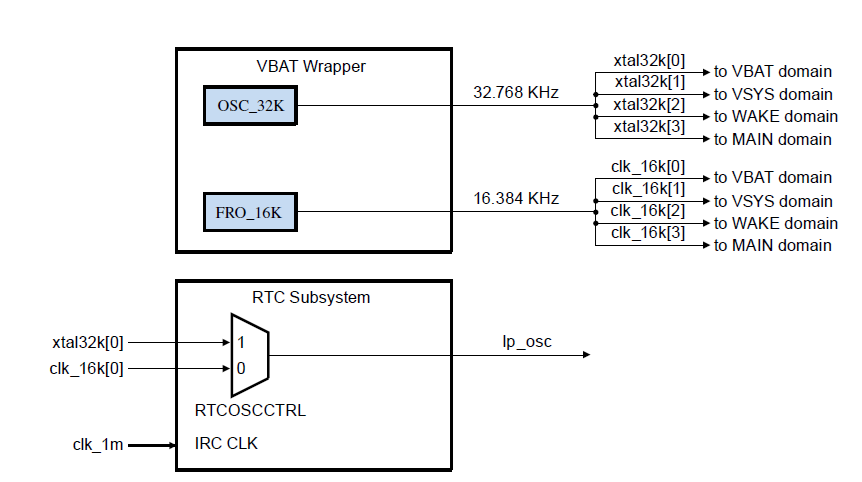
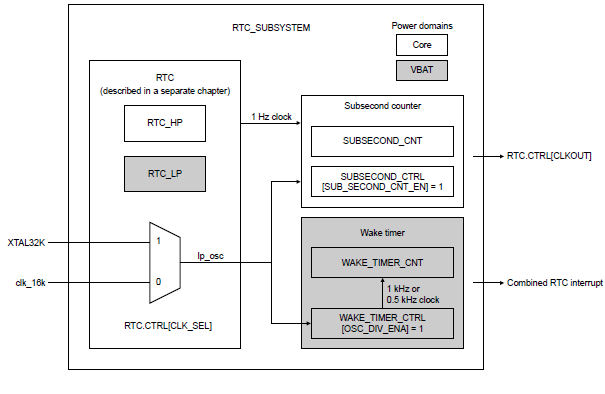
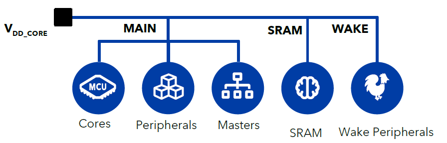
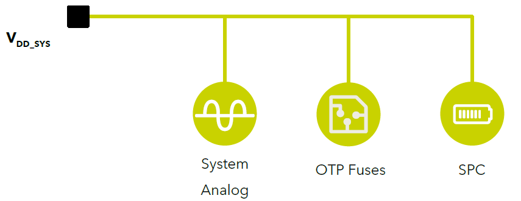
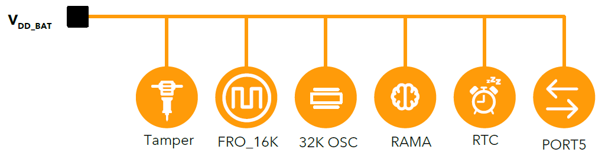
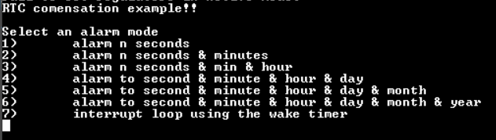
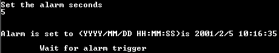
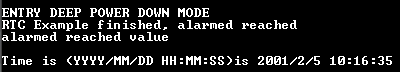

# NXP Application Code Hub
[](https://www.nxp.com)

## Using the Real Time Clock (RTC) on MCX
This code is part of an application note base on thr RTC module on MCX, this application note can be found on (insert link of appnote on nxp page) under the name of fulanito and contains more details of this code, power modes, power measuring, how to interact with the software.

This example serves as a guide on enabling the RTC module on MCX, selecting the correct clock source, enable the time keeping functions, enabling the alarm mode and wake timer to wake the MCU from a Deep Power Down state.

The RTC (real time clock) module found on the MCX-N5 is targeted to be a time keeping and alarm setting in various applications in which keeping track of the time and set events while keeping the power consumption at its lowest possible, also works when working at the deepest power saving mode and set this module to recover the MCU from this mode and be ready for any data transfer or processing. This application note is intended, how to use and configure the module on MCX, set up the clock sources, set the RTC module to be able to wake up the microcontroller form sleep, deep sleep, power down and deep power down state and wake up the CPU for processing data or executing any task and re-entry the low power state.

#### Boards: MCX-N9XX-EVK, FRDM-MCXN947
#### Categories: Low Power
#### Peripherals: CLOCKS
#### Toolchains: MCUXpresso IDE

## Table of Contents
1. [RTC Overview](#RTC_Overview)
2. [RTC Operation Modes](#RTC_Op)
3. [RTC Clock Sources](#RTC_Clk)
4. [RTC Wake Up Interrupt](#RTC_WUI)
5. [RTC Compensation Logic](#RTC_Compensation)
6. [RTC Subsystem](#RTC_SubSys)
7. [RTC Low Power Operation](#RTC_LP)
8. [MCX-N Power Modes](#MCX_LP_Modes)
9. [MCX-N Power Domains](#MCX_PD)
10. [Software Implementatios](#SW)
1. [Software Requirements](#step1)
2. [Hardware](#step2)
3. [Setup](#step3)
4. [Results](#step4)
5. [FAQs](#step5) 
6. [Support](#step6)
7. [Release Notes](#step7)

## 1. RTC Overview<a name="RTC_Overview"></a>
Real Time Clock (RTC) is a low-power module that provides time keeping and calendaring functions, protection against spurious memory/register updates. It can also compensate the 1 Hz clock against variations in 32 kHz or 16 kHz clock in oscillator due to crystal or temperature.
RTC subsystem includes a real-time clock (RTC), a sub second counter, and a wake-up timer.
RTC handles the following:

1. Basic clock functions
    - Calendaring support
    - Automatic adjustment for daylight support
    - Automatic adjustment for month and lap year
    - Time zone offset

2.	Programable Interrupts and alarms
3.	Time and calendaring functions 
4.	Clock compensation logic
    - Compensate 1Hz clock to counters against frequency variations

## 2. RTC Operation Modes<a name="RTC_Op"></a>
RTC on MXC devices can run on different operation modes depending on the power supply domain and the clock source that feed the timer counter and the module registers.
### 2.1 Wait mode

    RTC is fully operational in Wait mode. RTC runs off a 32.768 or 16.384 kHz clock that is not gated in Wait mode. This means the timekeeping functions (and other functions) that depend on the 32.768 or 16.384 kHz clock continue to operate independent of CPU. Only the register block's clock is gated and no register contents are lost.

### 2.2 Stop mode
    In STOP mode the RTC is fully operational and as in wait mode, but if CPU power is removed (VDD) the RTC switches the power supply source to battery (VBAT) and isolates from other power domains. This means the RTC is fully operations as wait mode, but in stop mode is the moment when the power rail from VDD is removed and switches to the VBAT domain.

### 2.3 Vbat mode
    In VBAT mode the RTC is fully operational, the 32.768khz or 16.384 kHz clock is not gated in VBAT mode and RTC's timekeeping functions (and other functions) that depend on the clock continue to operate independent of the CPU. Only the register block's clock is gated and no register contents are lost. After coming out of VBAT mode, the register content is not accessible for two osc_clk cycles due to synchronization.
    In VBAT mode the RTC fully relies on VBAT domain power rails and the VBAT domain clock_in options that are a 16Khz internal Free running oscillator, and  optional the external 32khz oscillator, to feed the timer counters and register to keep this module functionality.


## 3. RTC Clock Sources<a name="RTC_Clk"></a>
Before accessing to any RTC registers, it is necessary to select module clock in by setting CTRL[CLK_SEL]. RTC has a 32 kHz clock input from the oscillator and a 16 kHz clock input from the FRO. You can select which clock to use and the selected clock as an output to the peripheral and divided to generate a 512 Hz clock and a 1 Hz clock.

<p align="center">

</p>

## 4. RTC Wake up Interrupt<a name="RTC_WUI"></a>
Due to its low power capability the RTC module  can stay ON during low power operation and by an interrupt asserted on the VBAT module it’s able to transition from power status and wake up the CPU.

An RTC interrupt asserts the VBAT.STATUS[IRQ2_DET], This interrupt can optionally be configured as a source to assert the WAKEUP_b pin. When the device is operating in the VBAT power mode, you can transition the device back to active mode by configuring an external circuitry to recognize the WAKEUP_b assertion and request for a system power on.


## 5. RTC Compensation Logic<a name="RTC_Compensation"></a>
The RTC module has a compensation logic that corrects clock variations due to crystal offsets, temperature frequency variations and can correct a wide range of crystal offsets from as low as 0.119 PPM.
In this logic there are 2 components fine and coarse compensation, the coarse compensation provides an accurate clock to RTC's internal time and date counters, and fine compensation generates an accurate1 Hz clock output (via MCU pin) with high resolution clock edge placement (up to 0.88 ppm) and near 50 percent duty cycle, the fine compensation logic takes the coarse 1 Hz clock (from coarse compensation block) and generates accurate 1 Hz clock output with accurate clock edge placement and near 50 percent duty cycle.
### 5.1 Fine compensation
    In the fine compensation there are two parameters that need to be covered, the integral compensation value, that is a two’s complement value that has to be adjusted every second, and the second parameter is the fraction compensation value which corresponds to the fractional part of the correction or compensation value that has to be adjusted. This value is expressed as the number of clock cycles of a fixed 4.194304 MHz clock that have to be added. This value is always a positive number.

### 5.1 Coarse compensation
    In the coarse compensation there are two parameters that need to be covered, the compensation correction value, that is a two’s complement value by which the 1Hz clock will be modified by adding or removing that value to the RTC  oscillator clock cycles, and the second parameter is the compensation interval which corresponds to the compensation interval (in seconds) over the correction is applied.

## 6. RTC Subsystem<a name="RTC_SubSys"></a>
The RTC also supports the RTC subsystem, this subsystem provides the rtc module with two more features and components such as a sub second counter and a wake timer.
The implementation of the sub second counter has to be done in the core_main power domain, in the other hand the wake timer and RTC module resides in the VBAT domain.
The RTC subsystem receives also either the 16Khz FRO  or the 32KHz external crystal signal input.
<p align="center">

</p>

### 6.1 Subsecond counter
    The sub second counter is a 16 bit counter that is clocked by either the 16Khz FRO or the 32Khz crystal signal, this counter function support in real time applications.

    The value of this counter must be combined with the 1 second counter for a more precise time reading, also notice that this cunter value does not contribute to the alarm, interrupt, or wake up generation.

    SUBSECOND_CNT is disabled whenever RTC is reset or the main RTC 1 Hz counter is disabled. It must be independentlyenabled by setting SUBSECOND_CTRL[SUB_SECOND_CNT_EN] = 1 after enabling RTC chapter CTRL[CLKOUT] (Seechip-specific RTC_SUBSYSTEM information.) to choose the 1 Hz clock output. Once enabled, the counter waits until the start of the next 1 second interval and then begins incrementing at the RTC clock source rate. As long as the counter is enabled, SUBSECOND_CNT rolls over to zero and resumes counting at the start of each 1 second interval.

### 6.1 Wake Timer 

    The wake timer is a 16 bit timer that is clocked by either a 1kHz or 0.5Khz, depending on the valuer of the WAKE_TIMER_CTRL[OSC_DIV_ENA] register,  the clock signal that is derived from the RTC clock source, this timer offers a a greater degree of resolution than the 1 second interval provided by the RTC.
    The wake timer is a stand-alone wake up timer for a minimum interval of approximately 1 millisecond and a maximum of 64 seconds.
    Writing any non-zero value to this timer automatically enables the counter and launches a countdown sequence. When the counter is being used as a wake timer, this write can occur prior to entering a low-power mode. When a starting count value loads, the wake timer turns on, counts from the pre-loaded value down to zero, generates an interrupt and/or a wake command, and then turns itself off until relaunched by a subsequent software write.
    The Wake timer interrupt also takes place in the RTC module interrupt.

## 8. MCX-N Power modes<a name="RTC_LP"></a>
### Clock operation
    Via VBAT module in the battery supply domain it works with the power management system to implement power-saving mechanisms. It implements a 16khz FRO (free running oscillator),  and the capability for oscillator at 32.768 kHz crystal (OSC32k). It also includes a clock monitor (high/low/loss) for the OSC32k clock source.
### Power Down Prepare
    Some things to have in consideration is to prepare the chip for low power entry mode that by setting the VBAT and SPC modules for that entry, by enable the proper clock gate to the specific low power modules in the corresponding power domain for a proper functioning of the modules, also for better performance or application requirements enable or disable the power of chip SRAMS in order to maintain some ram capabilities in exchange of consuming mor power, and also disable the bandgap for an extra save in power consumption.
    For the SPC disable all High/Low voltage detectors for, enable the SPC to control all analog modules and also disable it’s internal bandgap, active regulators and glitch detectors in order to avoid conflicts with the low power entry.
    Also for the entry in power down mode you need to configure a proper wake up source and by that repowering all modes and enabling the normal execution of your program.
    That can be configured by the WUU (Wake up unit) and via a selectable interrupt by GPIO, LPTMR, RTC, CMP, DMA, SPC, VBAT, TDET modules.

### Power Down Mode Entry
    For power down entry you have to isolate for the power domains that are not being used, you can set that in the SPC module, then using the CMC (Core Mode Controller) indicate which clocks will be turned off (corresponding to the desired low power mode) and then entry the low power mode.

## 8. MCX-N Power modes<a name="MCX_LP_Modes"></a>
On MCX-N devices there are 6 power modes available: (For detailed information about MCX N power modes see MCXNx4x power management application note ).

### 8.1 Sleep mode
    When entering Sleep mode, the clock to CPU0 is turned off. The system clock and bus clock remain on, and most modules can remain operational. Any interrupt will wake the MCU, and the wake-up time is very short. 
    Sleep mode is an easy power mode for an application to enter when Idle, because entry is very simple, and the MCU will wake very quickly from any interrupt. And Sleep mode can reduce the power consumption substantially compared to Active mode.
### 8.2 Deep Sleep mode
    The Deep Sleep mode reduces power more than Sleep mode because also disables the system and bus clocks. SRAMs are in a State Retention mode, and cannot be accessed. 
    Some modules can remain operational and can serve as wake-up sources. But these modules need to be configured to clock from an asynchronous clock.
    Deep Sleep mode also supports a partial wake-up, where a wake-up event can wake the DMA while the CPU does not wake-up.

### 8.3 Power Down mode
    Power Down mode is the deepest power mode that can still retain all the SRAM and registers, and wake through the interrupt flow. Most of the MCU is in a static state. The flash memory is powered off.
    In Power Down mode, the CORE_MAIN and CORE_SRAM subdomains are in Static Retention mode, and are not accessible. The CORE_WAKE subdomain can be configured to stay in the low-power Deep Sleep state, or enter the static retention Power Down state. When these subdomains are in the Power Down state.
### 8.4 Deep Power Down mode
    In Deep Power Down (DPD) mode, the whole CORE domain, including all subdomains, is power-gated, and most registers do not retain their state. The MCU wakes from DPD mode through the Reset routine. Most SRAM is powered down, and only the RAMA partition can be retained using the VBAT domain. The regulators DCDC_CORE and LDO_CORE are powered off, while the LDO_SYS regulator continues to power the SYSTEM domain. Wake-up sources are only an external reset, or the peripherals in the SYSTEM or VBAT domain.
### 8.5 VBAT
    VBAT mode is the deepest power mode offered in the MCU, and consumes the least amount of power. VBAT is entered by externally powering off the VDD_SYS and VDD_CORE supplies. For example, an external power switch or PMIC can power off these supplies. Most SRAM is powered down, and only the RAM-A partition can be retained using the VBAT domain.
    Waking from VBAT mode is a “power on reset” (POR) sequence. 
    Only these sources in the VBAT domain can wake the MCU from VBAT mode:
    •	VBAT_WAKEUP_b pin
    •	MCU Monitors: POR, clock error, voltage error,  temperature error
    •	VBAT domain Timers: RTC, Wake Timer, VBAT Bandgap Timers

## 9. MCX-N Power Domains<a name="MCX_PD"></a>
The entire microcontroller has three different power domains: (For detailed information about MCX N power domains see MCXNx4x power management application note ).

### 9.1 Core Domain
    This domain is the main digital domain of the MCU. The CORE domain is powered by the VDD_CORE supply pin. The CORE domain is further divided into three subdomains: CORE_MAIN, CORE_SRAM, and CORE_WAKE
<p align="center">

</p>

### 9.1 System Domain
    The SYSTEM domain manages the power of the MCU, and includes key analog features for the system, plus the OTP fuses. In Deep Power Down mode, the SYSTEM domain remains powered while the CORE domain is powered off. The SYSTEM domain also includes the SPC, LVD/HVDs, IVS, DCDC, LDOs, WUU0, CMPs0/1, LPTMRs, and PLLs. The SYSTEM domain is powered by the VDD_SYS supply pin.
<p align="center">

</p>

### 9.1 Vbat Domain
    The VBAT domain enables a battery retention domain when all other supplies to the MCU are powered off. The VBAT domain permits the lowest power level, and is powered by the VDD_BAT supply pin. This domain contains very low-power peripherals that some applications consider always-ON, like: the tamper detects, RTC, FRO_16K, 32K OSC, RAMA retention, and PORT5 GPIO pins.
<p align="center">

</p>

## 10. Software Implementations<a name="SW"></a>
This chapter is intendent to serv as a quick guide on how to set the microcontroller into another power mode and then come back to active mode by using the RTC interrupt, this chapter configures the power modules to change between power modes and come back to active mode by RTC interrupt, this chapter also enables and configures correctly the RTC interrupt to wake up at the desire time or rate.

## 11. Software<a name="step1"></a>
This exmple only requires the corresponding MCX SDK and an IDE, can be either MCUXpresso or the MCUXpresso extension for visual studio code in order to compile and flash the program to the board.
This tools (such as SDK and MCUXpresso IDE) can be foun on NXP's page:
https://nxp.com/mcuxpresso.*

## 12. Hardware<a name="step2"></a>
- Mini/micro USB cable
- MCX-N9XX-EVK/MCX-N5XX-EVK/FRDM-MCXN9XX/FRDM-MCXN5XX board
- Personal Computer

## 13. Setup<a name="step3"></a>
*For app notes and ap sw packs you can refer the reader to the documentation from the introduction here. For demos and code snippets/general code you should provide a description of how to build and run the code. Steps 1, 2, etc. can be added/deleted as appropriate.*

1.  Connect a micro USB cable between the PC host and the MCU-Link USB port on the board
2.  Open a serial terminal with the following settings (See Appendix A in Getting started guide for description how to determine serial port number):
    - 115200 baud rate
    - 8 data bits
    - No parity
    - One stop bit
    - No flow control
3.  Compile the program
4.  Download the program to the target board.
5.  Either press the reset button on your board or launch the debugger in your IDE to begin running the demo.

### 13.1 Step 1

```
After downloading the program a message will be displayed, interact with the terminal to configure the RTC as desired, this configuration will be used for the rest of the example.
```
<p align="center">

</p>

```
Set the clock source.
```
<p align="center">

</p>

```
Select the RTC compensation.
```
<p align="center">

</p>

```
Select the RTC date as the terminal requires you to set.
```
<p align="center">

</p>

### 13.2 Step 2
After configuring the RTC now select the RTC function to be used, it can be to set an alarm or to use the wake up timer (using the wake up timer gives more resolution on the alarm wake period, giving more resoltion compare to the 1 second minimum alarm resolution up to 1ms resolution using the wake up timer).

```
Example using alarm set to n seconds
```
<p align="center">

</p>

```
Set the seconds to trigger the alarm 
```
<p align="center">

</p>


```
After selecting the desire option the mcu will go into deep power down state, this will turn off most of mcu's capabilities and peripherals and will stay on that state until either the RTC alarm o wake up timer count is reached.
```
<p align="center">

</p>

For more information about MCX power modes, power measuring and RTC configuration please refer to the appnote mentioned on this document.

## 14. Results<a name="step4"></a>
After selecting the desire option the mcu will go into deep power down state, this will turn off most of mcu's capabilities and peripherals and will stay on that state until either the RTC alarm o wake up timer count is reached.
When the MCU wakes up after the alarm is reached this message will be displayed on the terminal, after this message the rtc alarm mode can be reconfigured.

Also after implementig the Deep Power Down State a significant amount of power is saved. That can be observed in the Following Voltage, Current and Wake time Graphs.

### Static Current consumption
    Configuration:
    RTC : FRO @16kHz
    Cortex-M33 : PLL @150MHz
    VDD Core : 3,3V
<p align="center">

</p>

### Deep Power Down Current consumption
    Configuration:
    RTC : FRO @16kHz
    Cortex-M33 : PLL @150MHz
    VDD Core : 3,3V
<p align="center">

</p>


For more information about MCX power modes, power measuring and RTC configuration please refer to the appnote mentioned on this document.
## 15. FAQs<a name="step5"></a>
*No FAQs have been identified for this project*

## 16. Support<a name="step6"></a>

If you have any questions or feedback on this code please contact NXP support or post on our community at https://community.nxp.com/. You can find forums here for different aspects of this code example, including GUI Guider, MCUXpresso tools and device families.
NXP Community
NXP Community forums provide a platform for engineers, enthusiasts, and developers to collaborate, learn, and discuss NXP products and solutions.

#### Project Metadata
<!----- Boards ----->
[](https://github.com/search?q=org%3Anxp-appcodehub+MCX-N9XX-EVK+in%3Areadme&type=Repositories) [](https://github.com/search?q=org%3Anxp-appcodehub+FRDM-MCXN947+in%3Areadme&type=Repositories)

<!----- Categories ----->
[](https://github.com/search?q=org%3Anxp-appcodehub+low_power+in%3Areadme&type=Repositories)

<!----- Peripherals ----->
[](https://github.com/search?q=org%3Anxp-appcodehub+clocks+in%3Areadme&type=Repositories)

<!----- Toolchains ----->
[](https://github.com/search?q=org%3Anxp-appcodehub+mcux+in%3Areadme&type=Repositories)

Questions regarding the content/correctness of this example can be entered as Issues within this GitHub repository.

>**Warning**: For more general technical questions regarding NXP Microcontrollers and the difference in expected funcionality, enter your questions on the [NXP Community Forum](https://community.nxp.com/)

[](https://www.youtube.com/@NXP_Semiconductors)
[](https://www.linkedin.com/company/nxp-semiconductors)
[](https://www.facebook.com/nxpsemi/)
[](https://twitter.com/NXP)

## 7. Release Notes<a name="step7"></a>
| Version | Description / Update                           | Date                        |
|:-------:|------------------------------------------------|----------------------------:|
| 1.0     | Initial release on Application Code Hub        | December 20<sup>th</sup> 2023 |

